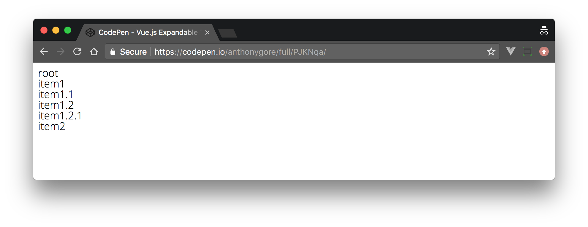
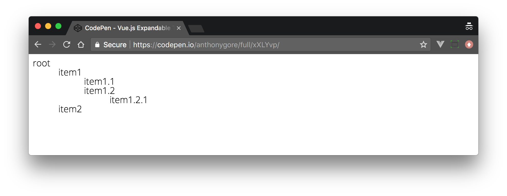
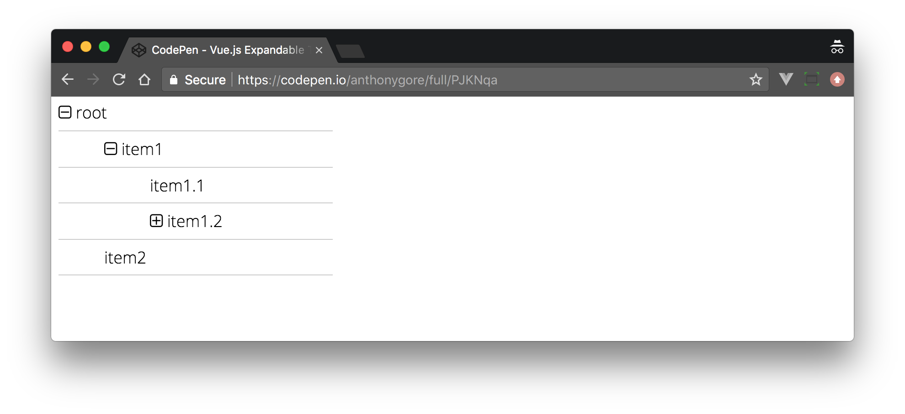

A *recursive component* in Vue.js is one which invokes itself e.g.:

```js
Vue.component('recursive-component', {
  template: `<!--Invoking myself!-->
             <recursive-component></recursive-component>`
});
```

Recursive components are useful for displaying comments on a blog, nested menus, or basically anything where the parent and child are the same, albeit with different content. For example:


To give you a demonstration of how to use recursive components effectively, I'll go through the steps of building an expandable/contractable tree menu.

> *Note: this article was originally posted [here on the Vue.js Developers blog](hhttps://vuejsdevelopers.com/2017/10/23/vue-js-tree-menu-recursive-components/?jsdojo_id=cjs_rec) on 2017/10/23*

## Data structure

A tree of recursive UI components will be the visual representation of some recursive data structure. In this tutorial, we'll use a tree structure where each node is an object with:

1. A `label` property. 
2. If it has children, a `nodes` property, which is an array of one or more nodes.

Like all tree structures, it must have a single root node but can be infinitely deep.

```js
let tree = {
  label: 'root',
  nodes: [
    {
      label: 'item1',
      nodes: [
        {
          label: 'item1.1'
        },
        {
          label: 'item1.2',
          nodes: [
            {
              label: 'item1.2.1'
            }
          ]
        }
      ]
    }, 
    {
      label: 'item2'  
    }
  ]
}
```

## Recursive component

Let's make a recursive component to display our data structure called `TreeMenu`. All it does is display the current node's label and invokes itself to display any children.

*TreeMenu.vue*

```html
<template>
  <div class="tree-menu">
    <div>{{ label }}</div>
    <tree-menu 
      v-for="node in nodes" 
      :nodes="node.nodes" 
      :label="node.label"
    >
    </tree-menu>
  </div>
</template>
<script>
  export default { 
    props: [ 'label', 'nodes' ],
    name: 'tree-menu'
  }
</script>
```


If you're using a component recursively you must either register it globally with `Vue.component`, or, give it a `name` property. Otherwise, any children of the component will not be able to resolve further invocations and you'll get an undefined component error.

### Base case

As with any recursive function, you need a *base case* to end recursion, otherwise rendering will continue indefinitely and you'll end up with a stack overflow.

In our tree menu, we want to stop the recursion whenever we reach a node that has no children. You could do this with a `v-if`, but our `v-for` will implicitly do it for us; if the `nodes` array is undefined no further `tree-menu` components will be invoked.

```html
<template>
  <div class="tree-menu">
    ...
    <!--If `nodes` is undefined this will not render-->
    <tree-menu v-for="node in nodes"></tree-menu>
</template>
```

## Usage

How do we now use this component? To begin with, we declare a Vue instance which has the data structure as a `data` property and registers the `TreeMenu` component.

*app.js*

```js
import TreeMenu from './TreeMenu.vue'

let tree = {
  ...
}

new Vue({
  el: '#app',
  data: {
    tree
  },
  components: {
    TreeMenu
  }
})
```

Remember that our data structure has a single root node. To begin the recursion we invoke the `TreeMenu` component in our main template, using the root `nodes` properties for the props:

*index.html*

```html
<div id="app">
  <tree-menu :label="tree.label" :nodes="tree.nodes"></tree-menu>
</div>
```

Here's how it looks so far:



## Indentation

It'd be nice to visually identify the "depth" of a child component so the user gets a sense of the structure of the data from the UI. Let's increasingly indent each tier of children to achieve this.



This is implemented by adding a `depth` prop to `TreeMenu`. We'll use this value to dynamically bind inline style with a `transform: translate` CSS rule to each node's label, thus creating the indentation.


```html
<template>
  <div class="tree-menu">
    <div :style="indent">{{ label }}</div>
    <tree-menu 
      v-for="node in nodes" 
      :nodes="node.nodes" 
      :label="node.label"
      :depth="depth + 1"
    >
    </tree-menu>
  </div>
</template>
<script>
  export default { 
    props: [ 'label', 'nodes', 'depth' ],
    name: 'tree-menu',
    computed: {
      indent() {
        return { transform: `translate(${this.depth * 50}px)` }
      }
    }
  }
</script>
```


The `depth` prop will start at zero in the main template. In the component template above you can see that this value will be incremented each time it is passed to any child nodes.

```html
<div id="app">
  <tree-menu 
    :label="tree.label" 
    :nodes="tree.nodes"
    :depth="0"
  ></tree-menu>
</div>
```

> Remember to `v-bind` the `depth` value to ensure it's a JavaScript number rather than a string.

## Expansion/Contraction

Since recursive data structures can be large, a good UI trick for displaying them is to hide all but the root node so the user can expand/contract nodes as needed.

To do this, we'll add a local state property `showChildren`. If false, child nodes will not be rendered. This value should be toggled by clicking the node, so we'll need a click event listener method `toggleChildren` to manage this.

```html
<template>
  <div class="tree-menu">
    <div :style="indent" @click="toggleChildren">{{ label }}</div>
    <tree-menu 
      v-if="showChildren"
      v-for="node in nodes" 
      :nodes="node.nodes" 
      :label="node.label"
      :depth="depth + 1"
    >
    </tree-menu>
  </div>
</template>
<script>
  export default { 
    props: [ 'label', 'nodes', 'depth' ],
    data() {
      return { showChildren: false }
    },
    name: 'tree-menu',
    computed: {
      indent() {
        return { transform: `translate(${this.depth * 50}px)` }
      }
    },
    methods: {
      toggleChildren() {
        this.showChildren = !this.showChildren;
      }
    }
  }
</script>
```


## Wrap up

With that, we've got a working tree menu. As a nice finishing touch, you can add a plus/minus icon to make the UI even more obvious. I did this with Font Awesome and a computed property based on `showChildren`. 

Inspect the [Codepen](https://codepen.io/anthonygore/pen/PJKNqa) to see how I implemented it.



> *Get the latest Vue.js articles, tutorials and cool projects in your inbox with the [Vue.js Developers Newsletter](https://vuejsdevelopers.com/newsletter/?jsdojo_id=cjs_rec)*
