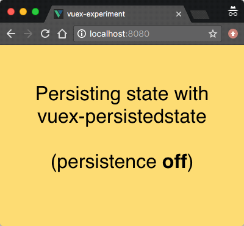

There are a lot of good reasons to use Vuex to manage the state of your Vue.js app. For one, it's really easy to add super-cool features with a Vuex plugin. Developers in the Vuex community have created a tonne of free plugins for you to use, with many of the features you can imagine, and some you may not have imagined.

In this article, I will show you five feature that you can easily add to your next project with a Vuex plugin.

1. Persisting state
1. Syncing tabs/windows
1. Language localization
1. Managing multiple loading states
1. Caching actions

> *Note: this article was originally posted [here on the Vue.js Developers blog](https://vuejsdevelopers.com/2017/09/11/vue-js-vuex-plugins/?jsdojo_id=cjs_vpl) on 2017/09/11*

## 1. Persisting state

[vuex-persistedstate](https://github.com/robinvdvleuten/vuex-persistedstate) uses the browser's local storage to persist your state across sessions. This means that refreshing the page or closing a tab won't wipe your data. 

A good use case for this would be a shopping cart: if the user accidentally closes a tab, they can reopen it with the page state intact.

## 2. Syncing tabs/windows

[vuex-shared-mutations](https://github.com/xanf/vuex-shared-mutations) synchronizes state between different browser tabs. It does this by storing a mutation to local storage. The storage event triggers an update in all other tabs/windows, which replays the mutation, thus keeping state in sync.

## 3. Language localization

[vuex-i18n](https://github.com/dkfbasel/vuex-i18n) allows you to easily store content in multiple languages. It is then trivial to switch languages in your app. 

One cool feature is that you can store strings with tokens e.g. "Hello {name}, this is your Vue.js app.". All your translations can have the same token where it's needed in the string.

## 4. Managing multiple loading states

[vuex-loading](https://github.com/f/vuex-loading) helps to manage multiple loading states in your application. This plugin is handy for real-time apps where changes in state are frequent and complex.

## 5. Caching actions

[vuex-cache](https://github.com/superwf/vuex-cache) can cache your Vuex actions. For example, if you're retrieving data from a server, this plugin will cache the result the first time you call the action, then return the cached value on subsequent dispatches. It's trivial to clear the cache when necessary.

I'd love to hear your favorite Vuex plugins in the comments below!

> *Get the latest Vue.js articles, tutorials and cool projects in your inbox with the [Vue.js Developers Newsletter](https://vuejsdevelopers.com/newsletter/?jsdojo_id=cjs_vpl)*
